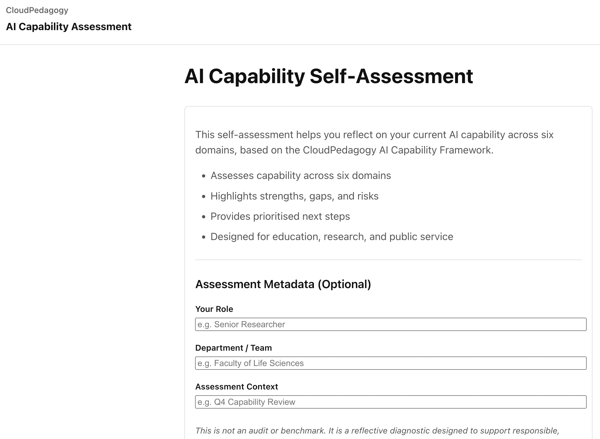

# AI Capability Self-Assessment Tool

A lightweight, static, browser-based AI capability self-assessment tool for reflecting on organisational readiness and maturity across six domains, based on the CloudPedagogy AI Capability Framework.

## 🔗 Role in the CloudPedagogy Ecosystem

**Phase:** Phase 3 — Capability System

**Role:**
Collects primary reflective data on organizational or team AI capability across six benchmark domains.

**Upstream Inputs:**
Manual user input based on the **CloudPedagogy AI Capability Framework**.

**Downstream Outputs:**
Exports structured JSON snapshots used by the **Capability Dashboard**, **Gaps & Risk** diagnostic, and **Scenario Stress Test**.

**Does NOT:**
- Perform automated benchmarking or institutional audits.
- Map capability coverage across academic programmes.

For a full system overview, see: [SYSTEM_OVERVIEW.md](../SYSTEM_OVERVIEW.md)

Designed for education, research, and public-service organisations, this open, framework-led tool supports reflective discussion and capability development rather than auditing, compliance, or benchmarking.

---
## 🌐 Live Hosted Version

👉 http://ai-capability-self-assessment-cloudpedagogy.s3-website.eu-west-2.amazonaws.com/

---
## 🖼️ Screenshot



---

## 🛠️ Getting Started

### Clone the repository

```bash
git clone [repository-url]
cd [repository-folder]
```

### Install dependencies

```bash
npm install
```

### Run locally

```bash
npm run dev
```

Once running, your terminal will display a local URL (often http://localhost:5173). Open this in your browser to use the application.

### Build for production

```bash
npm run build
```

The production build will be generated in the `dist/` directory and can be deployed to any static hosting service.

---

## 🔐 Strategic Context
- **Governance-First**: Designed to reveal organisational blind spots and structural fragility.
- **Insight-Driven**: Generates interpreted patterns and fragility signals, not just a score.
- **High-Integrity Data Collection**: Includes **Confidence Indicators** per question and mandatory **Metadata Snapshots**.
- **Privacy-Preserving**: Runs entirely in the browser; all data stays in `localStorage`.

---

## 📊 Strategic Data Collection Features

This tool has been strengthened to serve as the primary input layer for capability intelligence:

### 1. Snapshot Export System
Assessments are exported as timestamped snapshots (JSON and Markdown) containing:
- Capability scores across 6 domains.
- Metadata: Role, Department, and Assessment Context.
- Per-question confidence levels.

### 2. Optional Local Progress Tracking
The app maintains a local-only history of the last 10 assessments. This enables **Trend Analysis** in the results view, showing deltas (+/-) between current and previous self-assessments.

### 3. Confidence Indicators
Users indicate their confidence (Low/Medium/High) for every response. This ensures that downstream analytics tools can distinguish between "Estimated" and "Verified" capability states.

- [x] Implement confidence indicators
- [x] Enable local progress tracking
- [x] Standardise snapshot export format

---

## Overview

The AI Capability Self-Assessment helps individuals and teams explore how well their organisation is positioned to use artificial intelligence responsibly, effectively, and sustainably.

Rather than focusing on specific AI tools or technologies, the assessment examines organisational AI capability across six interdependent domains:

- Awareness  
- Human–AI Co-Agency  
- Applied Practice & Innovation  
- Ethics, Equity & Impact  
- Decision-Making & Governance  
- Reflection, Learning & Renewal  

## Key Characteristics

- Framework-led and non-prescriptive  
- Reflective rather than evaluative  
- Static and private (runs entirely in the browser)  
- Explainable, rule-based interpretation  
- No data storage, transmission, or tracking  

## Example Output


---

## Disclaimer

This repository contains exploratory, framework-aligned tools developed for reflection, learning, and discussion.

These tools are provided **as-is** and are not production systems, audits, or compliance instruments. Outputs are indicative only and should be interpreted in context using professional judgement.

All applications are designed to run locally in the browser. No user data is collected, stored, or transmitted.

All example data and structures are synthetic and do not represent any real institution, programme, or curriculum.

---

## Licensing & Scope

This repository contains open-source software released under the MIT License.

CloudPedagogy frameworks and related materials are licensed separately and are not embedded or enforced within this software.

---

## About CloudPedagogy

CloudPedagogy develops open, governance-credible resources for building confident, responsible AI capability across education, research, and public service.

- Website: https://www.cloudpedagogy.com/
- Framework: https://github.com/cloudpedagogy/cloudpedagogy-ai-capability-framework
